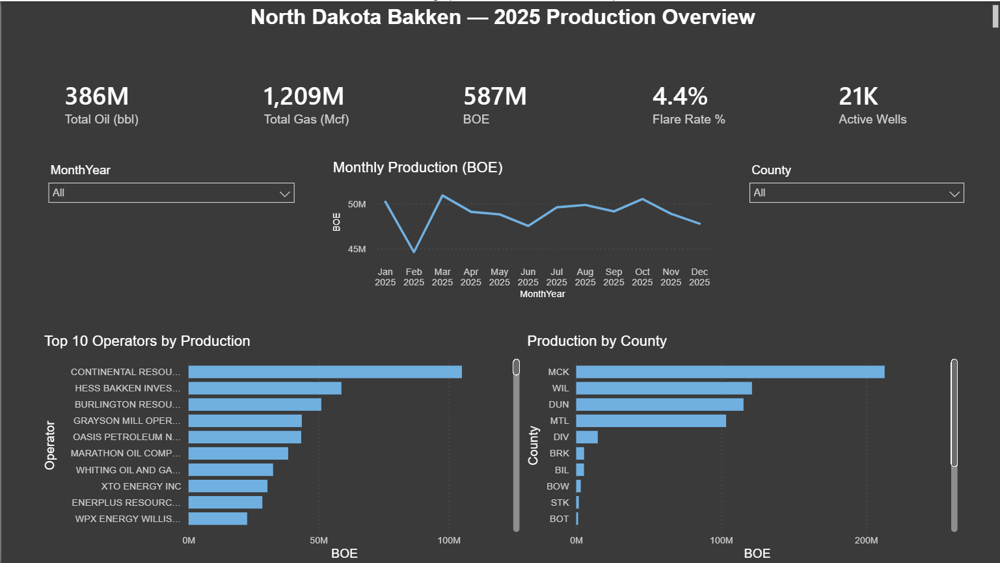
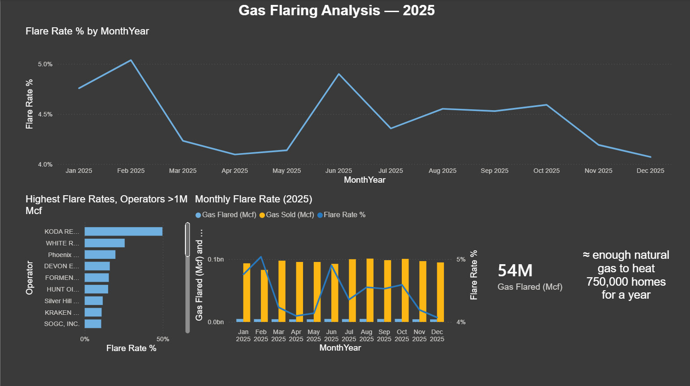
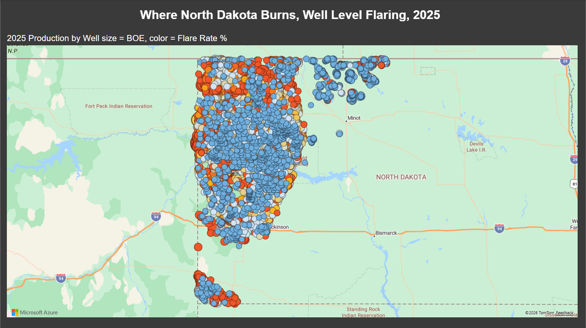
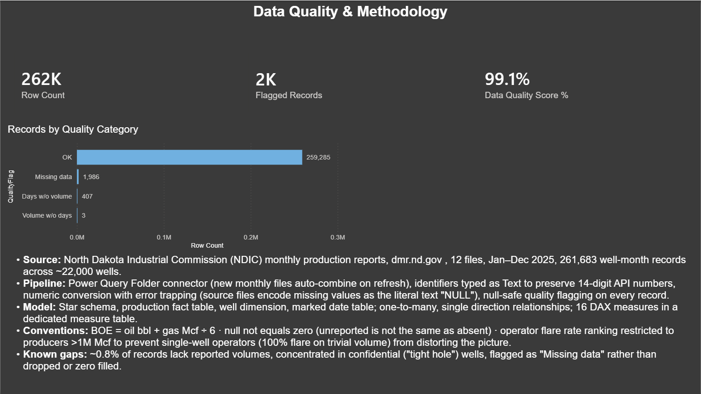

# North Dakota Bakken Production & Flaring Analysis (2025)

End to end Power BI project analyzing **386 million barrels of oil** and **1.2 billion Mcf of natural gas** produced across **~21,000 active wells** in North Dakota in 2025, built from 12 monthly public reports published by the North Dakota Industrial Commission (NDIC), totaling **261,683 well-month records**.

## Key insights

- North Dakota produced **386M bbl of oil** and **1,209M Mcf of gas** (≈ 587M BOE) in 2025, led by Continental Resources with over 100M BOE, more than the next two operators combined.
- **4.4% of all produced gas was flared**, roughly **54 million Mcf**, enough natural gas to heat **~750,000 homes for a year**.
- The trend is improving: the monthly flare rate fell from a **5.0% peak in February to 4.1% by December**, with a temporary re-spike in June (4.9%).
- Flaring is not evenly distributed. Among operators producing **>1M Mcf**, flare rates ranged from near zero (majors with gathering infrastructure, e.g. XTO, WPX) to **~45% (KODA Resources)**, the geographic map shows high flare wells concentrated on the basin periphery, away from pipeline infrastructure.
- **99.1% of records passed quality checks**; the ~0.9% flagged as missing volumes are concentrated in confidential ("tight hole") wells.

## Technical highlights

- **Ingestion:** Power Query Folder connector, 12 monthly Excel files combine automatically; next month's file drops in on refresh with zero rework.
- **Cleaning:** identifiers typed as Text to preserve 14-digit API well numbers; numeric conversion with error trapping (source files encode missing values as the literal text `"NULL"`); null safe data-quality flagging on every record. Full narrative in [cleaning_log.md](cleaning_log.md).
- **Model:** star schema — production fact table (261,683 rows), well dimension (~22,000 wells with coordinates), marked date table; one-to-many, single-direction relationships.
- **Semantic layer:** 16 DAX measures in a dedicated measure table, including BOE (6:1 gas conversion), Flare Rate %, Water Cut %, month-over-month time intelligence, and a Data Quality Score.
- **Report:** 4 pages — executive overview, flaring deep-dive, geospatial well map (bubble size = BOE, color = flare rate), and a data quality & methodology page.
- **Analytical judgment:** the operator flare-rate ranking is restricted to producers above 1M Mcf, without this threshold, single well micro-operators flaring 100% of trivial volumes dominate the ranking and mislead.

## Repository contents

| File | Description |
|---|---|
| `NDIC_Bakken_2025.pbix` | Full Power BI report queries, model, measures, all four pages |
| `01–04_*.png` | Dashboard page screenshots |
| `2025_01.xlsx` | One sample month of raw NDIC source data |
| `cleaning_log.md` | Data-quality issues found and how they were resolved |

## Reproduce it

Monthly source files are public: `https://www.dmr.nd.gov/oilgas/mpr/YYYY_MM.xlsx` (available 2003 - present, published ~45 days after month end). Download 12 months into a folder, open the .pbix, repoint the Folder source (Transform data → Data source settings), and refresh.

## Contact

**[Emmanuel Abia Lonku]** · [www.linkedin.com/in/lonku] · [emmalonku@gmail.com]

